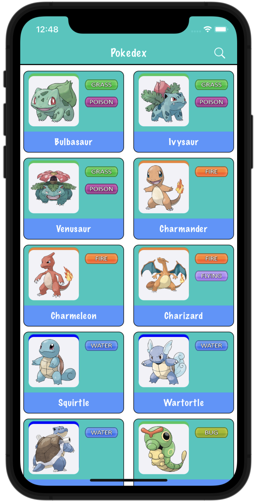
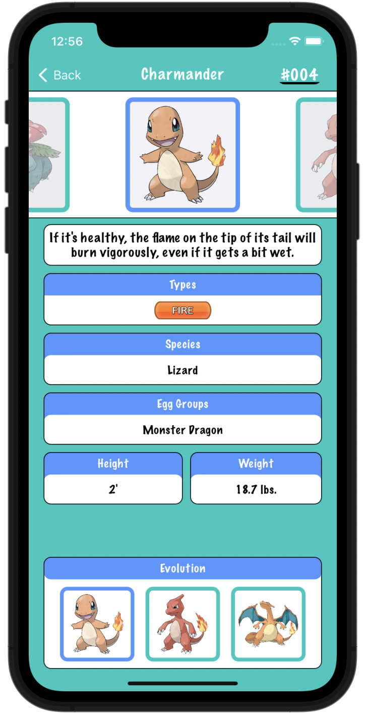

 
    <h1>Pokedex for iOS</h1> 
      
    
    

    
    

---
Pokedex is my first project. I had to use two different APIs.

https://pokedevs.gitbook.io/ (pokemon details)
 
https://pokeapi.co (for list of pokemons)

# Requirements

This app is built with:

- Deployment target: iOS 15.5
- XCode 13.4.1
- Swift 5.6.1

### Additional Packages

  - Alamofire (5.6.2)
  - JGProgressHUD (2.2)
  - SDWebImage (5.13.2)
  - SideMenu (6.5.0)
  - SnapKit (5.0.1)

# Videos

|  **Search Pokemon**  |  **Pokemon Detail**  |  
| ---- | ---- | 
|    |    |

